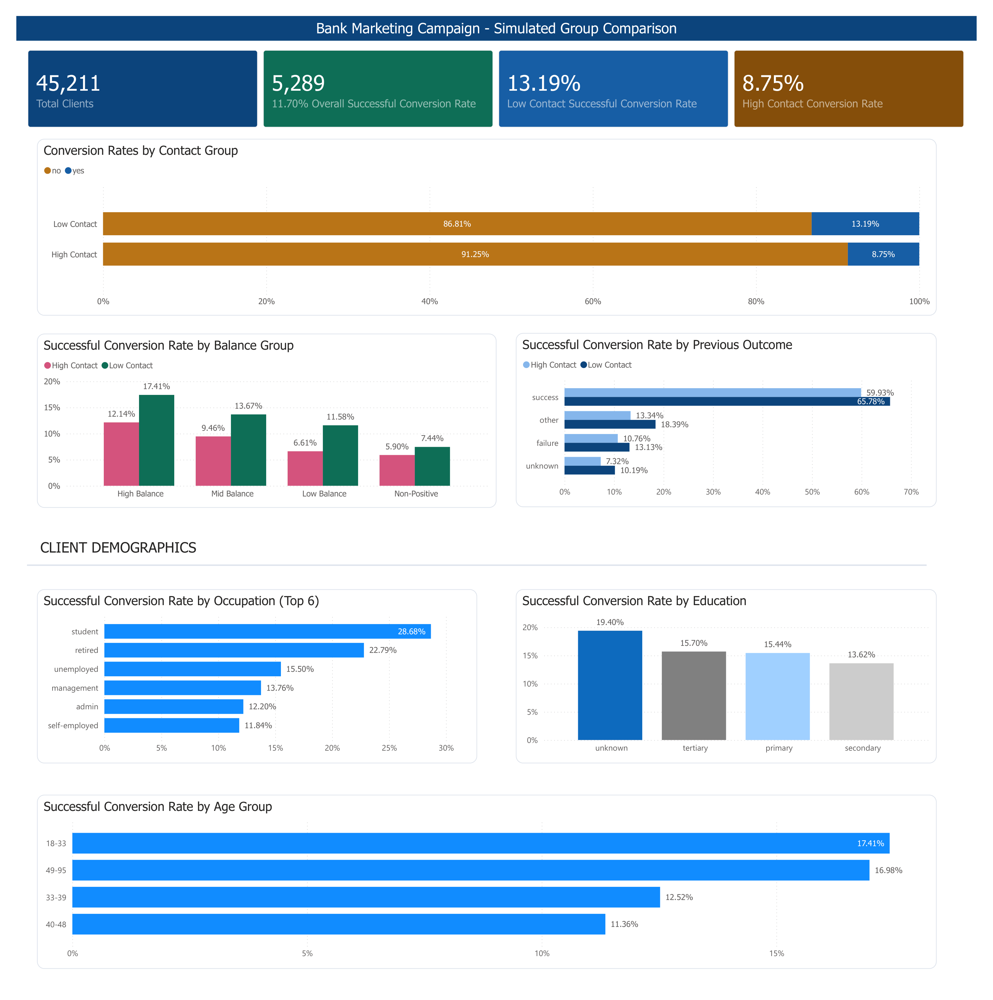

# Bank Marketing Campaign Analysis (SQL + Power BI Project)


Dataset: https://archive.ics.uci.edu/dataset/222/bank+marketing

---

## Overview
This project analyzes a bank marketing dataset to evaluate whether the number of marketing contacts is associated with client subscription rates for term deposits.

Using SQL, the project simulates an A/B-style comparison using observational data, grouping clients by contact frequency and exploring conversion patterns across multiple client segments. Since clients were not randomly assigned to contact groups, findings reflect associations rather than causal conclusions.

## Key Question:
Is contacting clients more frequently associated with higher subscription rates??

## Key Findings:
- Low Contact clients (1–2 calls) consistently show higher conversion rates than High Contact clients (3+ calls)
- This pattern persists across:
  - balance
  - age
  - job
  - education
  - contact method
  - previous campaign outcomes (poutcome)
- Balance and previous campaign outcome (poutcome) show the strongest association with conversion rates
- Higher contact frequency does not appear to improve conversion and may reflect harder-to-convert clients

## Methodology:
- Data cleaning and preprocessing in PostgreSQL
- Simulated a Low Contact vs. High Contact comparison using observational data:
  - Low Contact (Group A): Clients contacted 1–2 times
  - High Contact (Group B): Clients contacted 3+ times
  - Note: Groups are not randomly assigned. Differences in conversion rates may reflect underlying client characteristics
- Performed segmentation analysis across:
  - client demographics (age, job, education)
  - financial variables (balance)
  - campaign variables (contact, poutcome)
  - Used aggregation and conditional logic (CASE, GROUP BY, CTEs) to compute client conversion rates

## Dashboard Summary



The dashboard focuses on comparing successful conversion rates between Low Contact and High Contact client groups across multiple variables.

Key findings:
- Low Contact groups consistently achieved higher conversion rates
- Higher client balances are associated with higher conversion rates
- Previous successful campaign outcomes show the strongest association with successful client conversions
- Demographic variables such as education, occupation, and age show weaker relationships compared to balance and poutcome

This dashboard was made to provide a concise business summary of the exploratory analysis conducted in PostgreSQL

## Project Structure:
```
BANK-MARKETING-CONTACT-ANALYSIS
│
├── dashboard (contains Power BI dashboard files and exports)
│   ├── bank-marketing-dashboard-img.png
│   ├── bank-marketing-dashboard.pbix
│   └── bank-marketing-dashboard.pdf
│
├── data (contains all datasets used in the project)
│   ├── processed
│   │   ├── bank_marketing_clean.csv
│   │   └── bank_marketing_dashboard.csv
│   └── raw
│       └── bank-full.csv
│
├── documentation (contains notes for each stage of the analysis process)
│
├── sql (contains all SQL scripts used in the project)
│   ├── 01_database_setup.sql
│   ├── 02_data_checks.sql
│   ├── 03_data_cleaning.sql
│   ├── 04_eda_queries.sql
│   └── 05_visualization_table.sql
│
├── .gitignore
└── README.md
```

## Limitations
- This is an observational analysis - clients were not randomly assigned to contact frequency groups
- Differences in conversion rates may reflect underlying client characteristics rather than the direct effect of contact frequency
- The presence of 'unknown' categories in several columns (contact method, poutcome, job, education) introduces uncertainty and should be interpreted cautiously
- A properly randomized experiment would be needed to establish causal conclusions

## Status:
- Completed exploratory analysis and dashboard visualization in PostgreSQL and Power BI.
- Future improvements may include statistical significance testing (e.g., chi-square) and predictive modeling